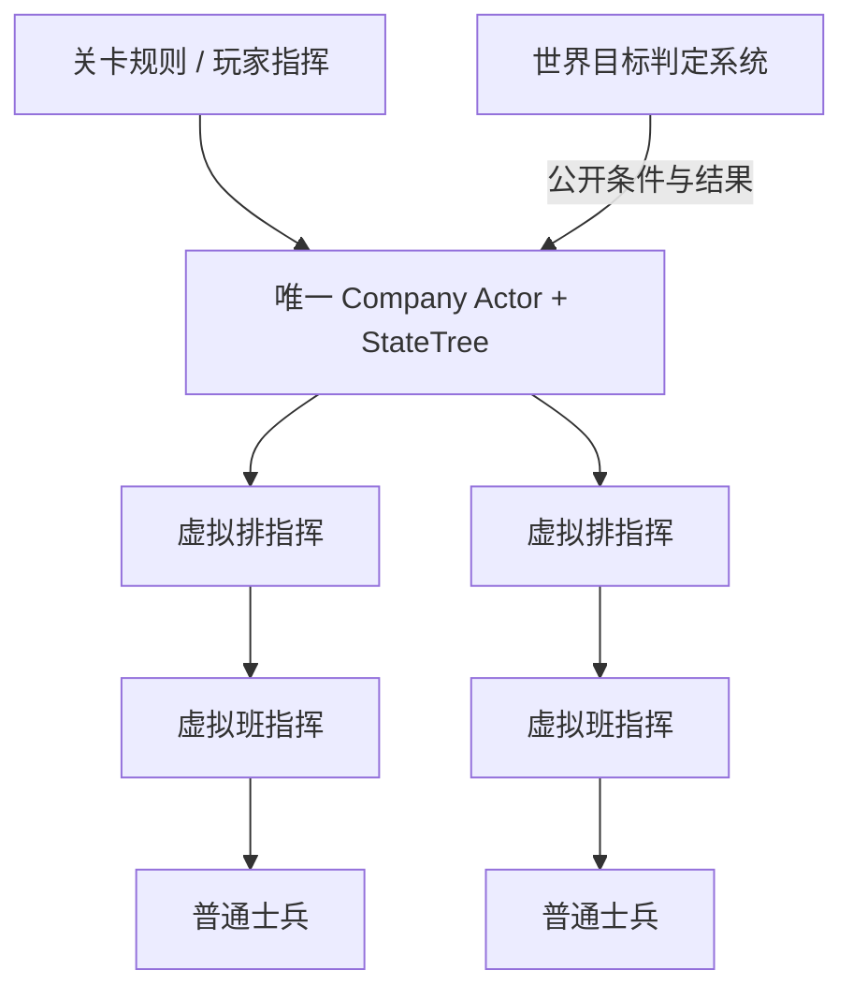

<!-- Copyright (c) 2026 Nelaric Contributors -->

# Demo 连级 AI：虚拟指挥与通用目标规则

每个权威运行世界只有一个有效的 `ADemoCompanyCommandActor`，运行一棵连级 StateTree。
连、排、班的指挥对象全部是逻辑对象，普通士兵身体只承担移动、射击、换弹、自卫和局部避险。
士兵伤亡或被玩家控制通过能力报告影响计划，不触发身体继任或全链权限换代。
直属排、班、成员由配置决定；Demo 角色池最多支持 512 个身体槽位，实际出场规模由生成配置决定。



## 实现与所有权

| 部分 | 所有者和职责 |
| --- | --- |
| 唯一注册 | `UDemoCompanyRegistrySubsystem`，隔离 Game / PIE 世界和客户端，只登记与验证发布者 |
| 反射契约 | `DemoCommandTypes.h`，共享任务、依赖、分配、许可、报告、计划、认知和目标结果 |
| 连级快照 | `UDemoCompanyContextComponent`，持有可查询的持久快照、权限代次和流程目标 |
| 连级协调 | Actor 生命周期持有的 `CompanyCoordinator.ts`，评估、分配、提交、监督和局部修复 |
| 连排归属 | 排级 Actor 上的 `UDemoCompanyMembershipComponent`，原生来源租约、候选信封与版本检查 |
| 排内协调 | `PlatoonCoordinator.ts`，向班发布任务，汇总能力、任务状态和独立 Ready |
| 目标事实 | `UDemoObjectiveWorldSubsystem` 与 `ADemoCommandArea`，维护空间登记与权威输入 |
| 目标业务 | 世界所有的 `ObjectiveAuthority.ts` 和纯规则 `ObjectiveRules.ts`，无任务分配或命令接口 |
| 配套资产 | 独立 Content 仓库中的连级与排级 Blueprint、StateTree 和配置数据资产 |

TS Coordinator 长期存在于 Actor 的运行绑定中，StateTree Task 只驱动一次流程操作。
退出 Supervise 不取消各排 Assignment、持续职责或正式资源预约。
目标原始输入只在规则适配器内采样；连级收到配置允许公开的 `FObjectiveResult`。
接口不提供隐藏敌人的位置、健康、弹药或内部状态。规则可以依据权威争夺事实发布 Contested 结果。

## 资产接入

先编译原生模块，执行 `Puerts.Gen` 更新声明，再在 `NelaricGameplay` 目录运行
`npm run typecheck` 与 `npm run build`。用项目安装的 PuerTS 生成
`TS_PlatoonCommand`、`TS_PlatoonPhase`、`TS_PlatoonAuthoring`、`TS_CompanyCommand` 代理。
PuerTS 的 Actor 代理是普通 Blueprint 资产，生成类类型为 `TypeScriptGeneratedClass`。

从独立 Content 仓库恢复与源码版本匹配的配套资产，再在编辑器中编译并验证
连级与排级 Blueprint、StateTree 和配置数据资产。资产编译与运行行为分别验证。

| 资产 | 路径或设置 |
| --- | --- |
| 连级 Actor | `/Game/Demo/Demo1_GrandWarfront/AI/Company/BP_DemoCompanyCommand` |
| 连级树 | 同目录 `ST_CompanyCommander`，通用 `UStateTreeComponentSchema`，Actor Context 绑定公司代理 |
| 配置 | 同目录 `DA_CompanyDefinition`、`DA_CompanyPolicy`、`DA_CompanyMission` |
| 排级 Actor / 树 | `/Game/Demo/Demo1_GrandWarfront/AI/Platoon/BP_DemoPlatoonCommand`、`ST_DemoPlatoonCommander` |

统一关卡启动入口放置或创建一个连级 Actor。填写 Definition 的 CompanyId、TeamId 和
ExpectedPlatoonIds；配置 Actor.Platoons 中对应的排，每排填写相同的稳定 PlatoonId、TeamId
和 Squads。排不得创建连级对象。每班继续使用现有普通成员初始化与班级执行树。
动态启动可调用 `UDemoCommandLibrary::CreateCompany`，传入连级类、定义、策略、初始任务与
完整排对象列表。重复调用返回同身份与阵营的已登记对象，不覆盖其正在运行的任务。
目标区域放置 `ADemoCommandArea`，设置唯一 AreaId、几何、容量和已实现的通行边。
示例任务需要 A、B 区域；实际任务目标与地图区域坐标须一致。

树不会将空名单解释为全军失能。登记满足完整配置名单后显式完成；超时报
RegistrationTimeout。重复连级 Actor 没有发布权限，树不会启动。
逻辑 Actor 仅在权威端运行，客户端通过 PlayerController 的服务器 RPC 提交请求。

## 协议与工作流

| 标识 | 有效性边界 |
| --- | --- |
| CompanyId / PlatoonId / SquadId | 稳定逻辑身份，普通树重启不生成新身份 |
| RunId | 世界切换与读档后的回调隔离 |
| CommandEpoch | 逻辑发布权限代次，不记录士兵伤亡 |
| MembershipRevision | 精确上下级归属版本 |
| AssignmentId + Revision | 单个排的具体任务，只对该任务生效 |
| PlanRevision | 整体方案追踪，不拒绝所有旧报告 |
| ReportSequence / TaskSequence | 分别排序能力与任务事实，同能力采样仍可处理新终态 |
| RequestGeneration / GateVersion | 异步查询与执行许可的独立隔离 |

分配先保留玩家锁定和有效持续职责，再检查报告新鲜度、能力、任务边界、已知风险、期限、
区域和通路资源。必要目标优先；评分包含紧迫性、解锁价值、已知风险、机会成本与改派成本。
整组能力和预约成功后才建立候选，不允许多个目标各占半套必要力量。
排被归属解除时只取消该精确租约，配置中的替换对象可重新登记。

提交阶段依次预留、接受、验证准备、授予许可、激活。候选保留期间旧任务继续承担职责；
需要离开旧区域的准备受到交接条件约束。轮换排达到 Ready 后才释放原排职责。
一部分变化已实际执行时，失败处理进行局部修复，不假定身体位置可以回滚。
接受失败、超时与权限丢失会释放未激活的临时预约。

```text
Bootstrap → AwaitMission → AssessSituation → BuildPlan → CommitChanges → Supervise
                                                     ↘ Hold           ↙ RepairPlan
AuthorityRecovery：只恢复逻辑授权
FinalizeMission：规则确认结果后登记结果，保留有效持续职责
Inactive：结束或组织解散时精确清理
```

每个叶状态一个主 Task；流程顺序由显式转换或 Coordinator 阶段决定。
监督长期 Running。普通报告更新事实；关键能力和持续条件失效影响对应目标及依赖闭包。
历史完成与当前控制分开，长期任务可保持 Executing + Ready。
无可行计划默认 Hold；Recover / Withdraw 必须在任务中授权且配置现有 FallbackAreaId。
回退不会抽空有效持续职责或覆盖玩家锁定，不会生成增援、补满弹药或创建资源。

## 目标与玩家接口

规则覆盖 Arrive、Regroup、Capture、Maintain、Search、Escort、All 和 Any。
占领争夺重置默认计时；持续条件立即撤回，可配置显式宽限。
搜索按配置子区执行，完成证据绑定精确任务与目标作用域，并满足整组排数。
到达与集结从授权分配冻结参与名单，伤亡或改派不会静默减少分母。
护送使用普通士兵的稳定身份、存活与检查点，不引入实体长官。
数据不足为 Unknown，不累计保持时间。历史成果与已验证搜索覆盖可入档。
SuccessCriteria 可显式选择结算目标，空时采用必要目标；FailureCriteria 指定当前成立即失败的条件。

连级代理提供 StartCommander、SubmitCompanyMission、SetCompanyMode、SetPlatoonManualScope、
SubmitManualPlatoonMission、CancelCompanyMission、GetDebugStatus、SaveCommandState、
RestoreCommandState 和 StopCommander。Mode 为 Autonomous、PlayerAssisted、PlayerManual、
Suspended。局部玩家锁定不提高全连 CommandEpoch；所有命令经过共同约束和资源入口。
PlayerController 的 RequestCompanyMission、RequestCompanyPlatoonScope、RequestCompanyPlatoonMission
及 RequestCompanySnapshot RPC 再次检查阵营、控制授权和排级范围。

## 恢复与诊断

存档保存任务、分配、玩家锁定、身份、剩余期限、规则进度和正式资源职责，不保存 UObject、
委托、定时器、路径句柄或候选事务。读档先校验整份语义，恢复匹配身体身份，重建授权和资源，
再等待新鲜报告。相同的任务身份对账采用原语义；需要重新恢复的下层执行单独发布。
存档槽位只接受字母、数字、下划线与连字符，快照大小有上限。

纯数据行为测试运行 `node Scripts/test_company.cjs`。
原生世界隔离测试名为 `Nelaric.Demo.Company.WorldAuthority`。
集成验证在 Demo1_Test 进行有上限的 PIE 验证，结束后恢复生成配置并销毁测试对象，
不保存临时测试关卡调整。超过 400 名实际士兵的压力场景应单独验证，
同时记录 Company 工作流耗时、ChangedAssignments、CancelledAssignments、
班级 PlanCancellationCount 和 RouteRequestCount。编辑器限帧与场景渲染成本必须另行识别。

资产保存、Blueprint 编译、StateTree 编译、TS 构建、原生构建、运行正确性和性能是不同证据。
完整联机拓扑、最终关卡通行容量和发布配置的 60 FPS 目标仍须使用项目目标场景验证。
